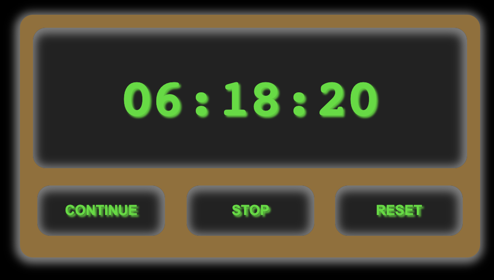

# retro_chronometer
A retro-styled chronometer made it with React.js.

This Repository was created to learn how to build a chronometer using functional Components and [Hooks](https://reactjs.org/docs/hooks-overview.html) with [React.js](https://reactjs.org/).

[See demo hier 👍](https://habidbesp.github.io/retro_chronometer/)

